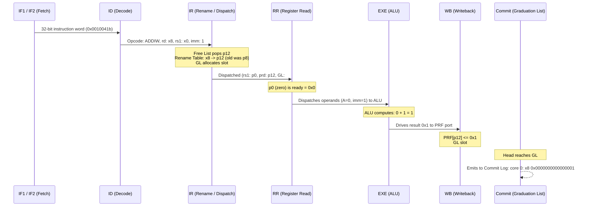
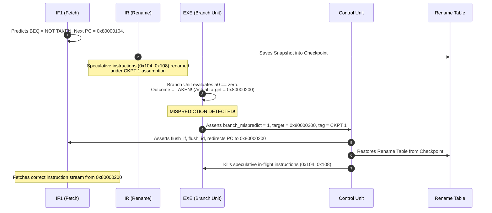

To understand how hardware units collaborate inside the **Sargantana `core_tile`**, this document walks through the step-by-step lifecycle of three representative operations:
1. **Trace 1: Basic Integer ALU Operation** (`addi s0, zero, 1`)
2. **Trace 2: Memory Load & Store Pipeline** (`ld` & `sd`) through LSQ and HPDCache
3. **Trace 3: Branch Prediction, Misprediction Detection & Checkpoint Rollback**

## 1. Trace 1: Integer ALU Operation

Consider the first instruction executed in the BootROM:
```assembly
addiw s0, zero, 1    # x8 = 0 + 1 (sign-extended 32-bit to 64-bit)
```



### Dynamic Trace Signatures

- **Konata Timeline**:
  ```text
  I  1  1  0         # Introduced
  S  1  0  F1        # Cycle 1: Fetch 1 (PC 0x100)
  S  1  0  F2        # Cycle 2: Fetch 2 (Cacheline returned)
  S  1  0  D         # Cycle 3: Decode
  S  1  0  Q         # Cycle 4: Buffered in Instruction Queue
  S  1  0  I         # Cycle 5: Renamed & Dispatched (p12 allocated)
  S  1  0  R         # Cycle 6: Register Read (p0 read = 0)
  S  1  0  A         # Cycle 7: ALU executes (0 + 1 = 1)
  R  1  1  0         # Cycle 8: Retired successfully (Status 0)
  ```
- **Commit Log (`signature.txt`)**:
  ```text
  core   0: 0x0000000000000100 (0x0010041b) addiw   s0, zero, 1
  core    0:  3 0x0000000000000100 (0x0010041b) x8  0x0000000000000001
  ```

## 2. Trace 2: Memory Load & Store Pipeline

Consider a load and store sequence:
```assembly
ld a0, 0(s0)    # Load double-word from [s0 + 0] into a0
sd a0, 8(s0)    # Store double-word from a0 into [s0 + 8]
```

### Memory Pipeline Walkthrough

```
  [EXE Stage: Mem Unit]
           |
    1. Address Gen (Base s0 + Offset 0)
    2. dTLB Translation (Virtual VPN -> Physical PPN)
    3. LSQ Allocation (Assign Load/Store Queue entry)
           |
   +-------+-------+
   |               |
(For LOAD)    (For STORE)
   |               |
   |               +--> Speculative Store Buffer (`store_buffer.sv`)
   |                    (Holds store data speculatively until Commit!)
   v
[HPDCache Port 1]
   |
   +--> Cache Hit?  --> Return 64-bit word directly to WB stage (Low latency)
   |
   +--> Cache Miss? --> 1. Allocate MSHR (Miss Status Holding Register)
                        2. Continue serving independent instructions
                        3. Issue burst read to L2 (`mem_req_read_valid_o`)
                        4. When L2 grants data (`mem_resp_read_valid_i`),
                           fill cacheline and wake waiting load instruction.
```

### Why Stores Are Buffered

To maintain precise exceptions, **stores cannot touch the cache or memory while they are speculative**. If an earlier instruction raises an exception (or a branch mispredicts), all speculative stores must simply be discarded.
- In Sargantana, the store sits in `store_buffer.sv`.
- Only when the store reaches the head of the Graduation List and commits does the core assert `is_commit_store_valid`.
- The Store Buffer then drains the store data into HPDCache.

## 3. Trace 3: Branch Prediction & Speculative Checkpoint Rollback

Conditional branches pose the greatest challenge to pipelined execution. Here is how Sargantana handles speculation and recovery:

```assembly
0x80000100: beq a0, zero, target_label   # Predicted NOT TAKEN in IF1
0x80000104: addi t0, t0, 1               # Speculatively fetched
0x80000108: slli t1, t0, 2               # Speculatively fetched
```



### Visualizing the Rollback in Konata

In `konata.txt`, you will immediately see the misprediction recovery:

```text
# Instruction 10: BEQ (Branch)
S  10  0  B      # Evaluated in Branch Unit
R  10  10 0      # Retired successfully

# Instruction 11 & 12: Younger speculative instructions flushed!
S  11  0  D
R  11  11 1      # Squashed! Displayed in RED in Konata
S  12  0  F1
R  12  12 1      # Squashed! Displayed in RED in Konata

# Instruction 13: Correct path instruction
S  13  0  F1     # Fetched from 0x80000200
S  13  0  F2
S  13  0  D
```

## 4. Key Takeaways for RTL Developers

1. **Check the Rename Table Checkpoints**: If you modify the decoder or branch predictor, ensure branch tags and checkpoint allocation pointers remain in lockstep.
2. **Observe the Store Buffer**: Memory corruption often occurs if stores drain before commit or if load-to-store forwarding fails in the LSQ.
3. **Use PMU Counters**: If performance is lower than expected, check `hpm_counters` event 18 (`data_depend`), event 20 (`grad_list_full`), and event 29 (`dcache_stall`).
