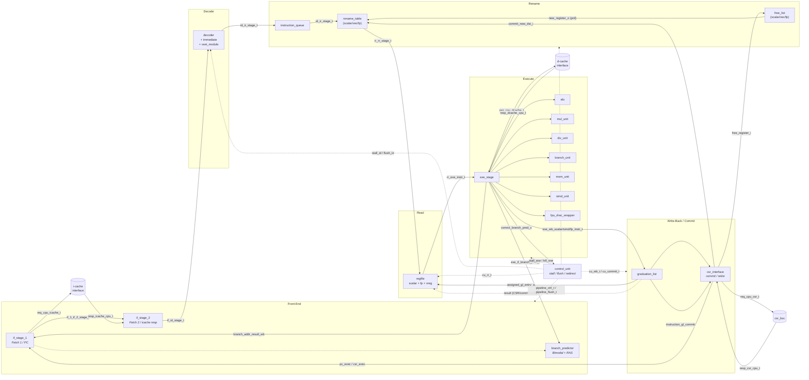

# Pipeline Overview

Top module: `rtl/datapath/rtl/datapath.sv` (`module datapath`, line 21).
It instantiates every stage register and stage unit and wires them together.
This file is the canonical wiring hub — **read it alongside this diagram**.

## Block diagram

### Module → document map

| Diagram node                                    | Document                                                                        |
| ----------------------------------------------- | ------------------------------------------------------------------------------- |
| `if_stage_1`                                    | [[if_stage_1]]                                                                  |
| `if_stage_2`                                    | [[if_stage_2]]                                                                  |
| `branch_predictor`                              | [[branch_predictor]]                                                            |
| `decoder`                                       | [[decoder]]                                                                     |
| `immediate`                                     | [[immediate]]                                                                   |
| `vset_module` / `vset_queue`                    | [[vset_module]], [[vset_queue]]                                                 |
| `instruction_queue`                             | [[instruction_queue]]                                                           |
| `free_list`                                     | [[free_list]]                                                                   |
| `rename_table`                                  | [[rename_table]]                                                                |
| `regfile`                                       | [[regfile]]                                                                     |
| `exe_stage`                                     | [[exe_stage]]                                                                   |
| `alu` / `mul_unit` / `div_unit` / `branch_unit` | [[alu]], [[mul_unit]], [[div_unit]], [[branch_unit]]                            |
| `mem_unit` (+ LSQ/SB/PMRQ)                      | [[mem_unit]], [[load_store_queue]], [[store_buffer]], [[pending_mem_req_queue]] |
| `vagu`                                          | [[vagu]]                                                                        |
| `simd_unit` / `fpu_drac_wrapper`                | [[simd_unit]], [[fpu_drac_wrapper]]                                             |
| `score_board_scalar` / `score_board_simd`       | [[score_board_scalar]], [[score_board_simd]]                                    |
| `graduation_list`                               | [[graduation_list]]                                                             |
| `csr_interface`                                 | [[csr_interface]]                                                               |
| `control_unit`                                  | [[control_unit]]                                                                |

---

## Stage-by-stage functional breakdown

All line numbers refer to files under
`core_tile/rtl/core/sargantana/rtl/datapath/rtl/`.

### 1. IF1 — Fetch 1 (`if_stage_1/rtl/if_stage_1.sv`)

- Holds the PC register and computes the next PC (`if_stage_1.sv:85` priority mux,
  `:123` `always_ff` PC update).
- PC selection is driven by `cu_if_i.next_pc` (`next_pc_sel_t`):
  `NEXT_PC_SEL_KEEP_PC`, `NEXT_PC_SEL_BP_OR_PC_4`, `NEXT_PC_SEL_JUMP`, `NEXT_PC_SEL_DEBUG`.
- Generates fetch exceptions: misaligned (`:154`), access fault (`:138`),
  guest page fault (`:147`).
- Drives the icache request (`:163` `req_cpu_icache_o.valid`) and the
  `if_1_if_2_stage_t` payload (`:170`).
- Instantiates [[branch_predictor]] (`:177`) which supplies
  `is_branch` / `taken` / `pred_addr`; predictions are packed into `fetch_o.bpred`
  (`:218`).
- Wired in `datapath.sv:411`; its output register is `reg_if_1_inst`
  (`datapath.sv:437`, flushed by `flush_int.flush_if`, stalled by `stall_if_2`).

### 2. IF2 — Fetch 2 (`if_stage_2/rtl/if_stage_2.sv`)

- Consumes the icache response and emits the instruction word.
  Exception priority: front-end exception → instr page fault → guest page fault
  (`if_stage_2.sv:74`).
- Instruction data selected from current or buffered icache response
  (`:105`); `valid` (`:107`); icache-miss stall (`:109` `stall_o`).
- Buffers an icache response across a stall in `resp_icache_cpu_q` (`:122`–`:156`).
- Wired in `datapath.sv:446`; output register `reg_if_2_inst`
  (`datapath.sv:461`, `if_id_stage_t`).

### 3. ID — Decode (`id_stage/rtl/decoder.sv`)

- Full instruction → micro-op decoder. Module header `decoder.sv:23`; ports
  `:26`–`:54`. Main combinational decode `:103`–…, opcode `case` starts `:195`.
- Uses [[immediate]] (`:98`) to build the immediate.
- Uses [[vset_module]] (`:3560`) for vector `vtype`/`vl` bookkeeping; outputs
  `vl_short_o` (`:3588`), `prev_vtype_o`, `full_vset_queue_o`.
- Emits `id_ir_stage_t` (`instr_entry_t instr` + `exception_t ex`), plus
  `jal_id_if_t` for JAL/JALR redirect (`:249`) and `id_cu_t` status.
- Decoded instruction is registered and can be replayed one cycle when stalled
  (`stored_instr_id_q` + `src_select_id_ir_q`, `datapath.sv:539`, `:544`, `:554`).
- Wired in `datapath.sv:476`; `id_cu_int` assembled at `datapath.sv:507`–`:520`.

### 4. IQ / IR — Instruction queue + Rename

- **[[instruction_queue]]** (`ir_stage/rtl/instruction_queue.sv:21`) is a circular
  buffer of `id_ir_stage_t` (`INSTRUCTION_QUEUE_NUM_ENTRIES = 16`); write/read at
  `:59`/`:63`, pointers `:81`, outputs `:102`–`:104`. Instantiated
  `datapath.sv:567`.
- **[[free_list]]** manages physical registers. Scalar `free_list_inst`
  (`datapath.sv:579`), SIMD (`:605`), FP (`:625`). Internals: checkpoint copies
  `free_list.sv:94`, read/write `:112`/`:99`, sequential update `:121`,
  `new_register_o` `:227`.
- **[[rename_table]]** maps arch → physical regs with per-checkpoint copies.
  Scalar `rename_table_inst` (`datapath.sv:647`), SIMD (`:685`), FP (`:727`).
  Internals: `rename_table.sv:132` comb update, `:219` output regs,
  `:285` `out_of_checkpoints_o`.
- IR→RR register `reg_ir_inst` (`datapath.sv:786`) packs
  `id_ir_stage_t + prd + fprd + pvd + checkpoint_done` into `ir_rr_stage_t`.
  A shadow copy `reg_rename_inst` (`datapath.sv:796`) + mux
  (`datapath.sv:806`–`:872`) replays rename under stall.
- Control inputs from `cu_ir_int`: `do_checkpoint/do_recover/delete_checkpoint/
recover_commit` (see [[drac_pkg]] `cu_ir_t`).

### 5. RR — Read registers + GL allocation

- **[[regfile]]** instances: scalar `regfile_inst` (`datapath.sv:1015`),
  FP `regfile_fp_inst` (`:1035`), vector `vregfile` (`:1057`).
  Module `rr_stage/rtl/regfile.sv:23`; internal write-through bypass `:57`,
  read mux `:71`, write `:84`.
- FP/scalar source muxing for `use_fs1/use_fs2` (`datapath.sv:1080`).
- **[[graduation_list]]** allocates an in-order slot per instruction:
  `assigned_gl_entry_o` (`datapath.sv:971`, `graduation_list.sv:297`).
- RR→EXE register `reg_rr_inst` (`datapath.sv:1128`) produces `rr_exe_instr_t`.
- Snooping of in-flight WB results into `prs/rdy` bits: `datapath.sv:982`–`:1010`.

### 6. EXE — Execute (`exe_stage/rtl/exe_stage.sv`)

- `exe_stage` header `:21`, ports `:28`–`:93`. Instantiated `datapath.sv:1241`.
- Readiness/scoreboard: `score_board_scalar` (`:178`) and `score_board_simd`
  (`:195`); `ready` (`:209`).
- Functional units: [[alu]] (`:339`), [[mul_unit]] (`:344`), [[div_unit]] (`:352`),
  [[branch_unit]] (`:361`), [[simd_unit]] (`:371`), [[vagu]] (`:458`),
  [[mem_unit]] (`:497`), [[fpu_drac_wrapper]] (`:544`).
- Operand source select (`use_pc`/`use_imm`) `:175`–`:176`.
- Stall aggregation per unit `:597`–`:639`; exception prioritisation `:642`;
  branch-prediction correctness `:674`; branch-prediction forwarding `:701`.
- Snoop of WB into EXE operands `datapath.sv:1140`–`:1200`.
- EXE→WB register `reg_exe_inst` (`datapath.sv:1338`/`:1347`) — note the
  `REGISTER_HPDC_OUTPUT` variant lets MEM results skip the EXE-WB register.
- Branch redirect latched into `branch_addr_result_wb` (`datapath.sv:1357`).

### 7. WB — Write-back

- Write-back payload assembly for scalar/SIMD/FP (`datapath.sv:1381`–`:1484`),
  including AMO masking (`:1378`, `:1385`) and `gl_valid/gl_index` arrays.
- Data mux to regfile write ports (`datapath.sv:1488`–`:1520`); CSR/VSETVL
  results injected on port 0 (`:1496`).
- WB status assembled into `wb_cu_int` (see [[drac_pkg]] `wb_cu_t`).

### 8. Commit — In-order retire (`interface_csr/rtl/csr_interface.sv`)

- `instruction_to_commit = instruction_gl_commit` (`datapath.sv:1526`), produced
  by [[graduation_list]] (`datapath.sv:972`).
- Commit validity / store-or-amo / xcpt logic `datapath.sv:1566`–`:1624`.
- **[[csr_interface]]** (`interface_csr/rtl/csr_interface.sv:23`) builds the
  CSR request (`:58`), decides retirement (`:211`), and produces
  `retire_inst_gl`.
- Redirect PC: `pc_evec_q` / `pc_next_csr_q` (`datapath.sv:1554`) feed the IF1
  PC mux via `pc_jump_if_int` (`datapath.sv:386`–`:404`).
- Free-list/rename commit updates are driven from `instruction_to_commit`
  (`datapath.sv:588`, `:667`, `:669`).
- OpenPiton PC queue for end-of-sim `datapath.sv:1781`–`:1824`.

---

## Key control structs (see [[drac_pkg]])

| Struct                                                        | Purpose                         | Lines                           |
| ------------------------------------------------------------- | ------------------------------- | ------------------------------- |
| `pipeline_ctrl_t`                                             | per-stage stall + `sel_addr_if` | `drac_pkg.sv:1018`              |
| `pipeline_flush_t`                                            | per-stage flush + `kill_exe`    | `drac_pkg.sv:1033`              |
| `id_cu_t` / `ir_cu_t` / `rr_cu_t`                             | stage → CU status               | `drac_pkg.sv:909`,`:919`,`:929` |
| `cu_if_t` / `cu_ir_t` / `cu_rr_t` / `cu_wb_t` / `cu_commit_t` | CU → stage control              | `drac_pkg.sv:933`–`:1015`       |
| `exe_cu_t` / `wb_cu_t` / `commit_cu_t`                        | stage → CU status               | `drac_pkg.sv:959`,`:972`,`:988` |
| `to_PMU_t`                                                    | performance events              | `drac_pkg.sv:1050`              |

## Stage boundary payload structs (see [[drac_pkg]])

| Boundary      | Struct                                  | Line               |
| ------------- | --------------------------------------- | ------------------ |
| IF1→IF2       | `if_1_if_2_stage_t`                     | `drac_pkg.sv:470`  |
| IF2→ID        | `if_id_stage_t`                         | `drac_pkg.sv:482`  |
| ID→IR         | `id_ir_stage_t` (wraps `instr_entry_t`) | `drac_pkg.sv:557`  |
| IR→RR         | `ir_rr_stage_t`                         | `drac_pkg.sv:562`  |
| RR→EXE        | `rr_exe_instr_t`                        | `drac_pkg.sv:594`  |
| EXE→WB scalar | `exe_wb_scalar_instr_t`                 | `drac_pkg.sv:829`  |
| EXE→WB SIMD   | `exe_wb_simd_instr_t`                   | `drac_pkg.sv:863`  |
| EXE→WB FP     | `exe_wb_fp_instr_t`                     | `drac_pkg.sv:894`  |
| GL entry      | `gl_instruction_t`                      | `drac_pkg.sv:1238` |
| GL write-back | `gl_wb_data_t`                          | `drac_pkg.sv:1278` |
